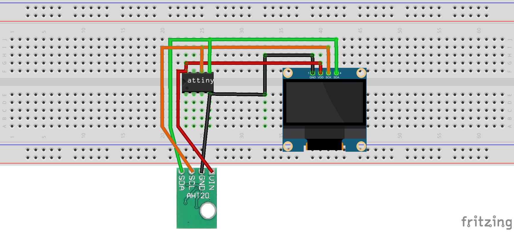
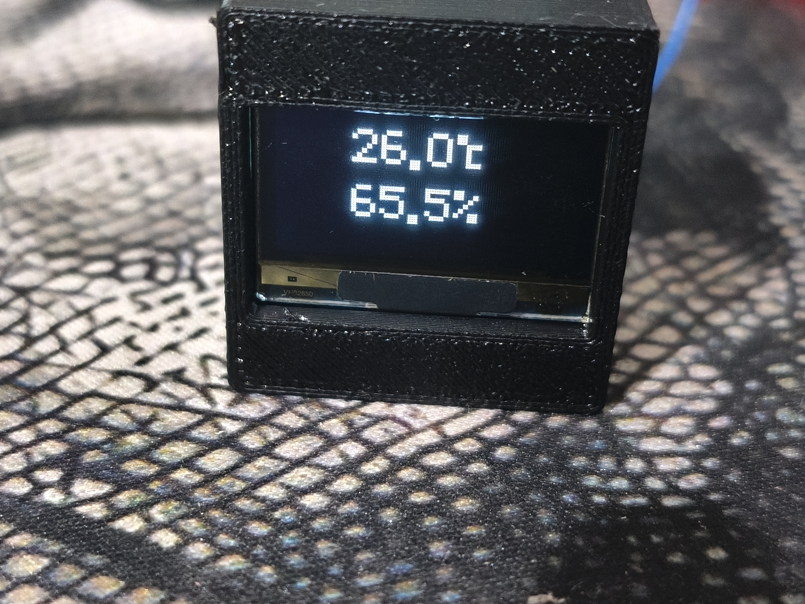

---------------------------------------ENG--------------------------------
AHT20 + SSD1306 AVR (No Arduino)

An AVR weather station project written in pure C (developed in VS Code). Features bit-banged I2C and a custom display output optimized for strict memory efficiency (Flash/RAM). 

Arduino libraries are not used.

Implementation Features
Bit-banged (software) I2C in `simpleI2C.c`. Can be assigned to any pins.
Number and symbol fonts (`.`, `°C`, `%`) are packed into Flash memory using `PROGMEM` (`oledSSD1306.c`).
The `oled_drawNum` function scales the font 2x on the fly using a lookup table (`doubleTable`). This outputs large, readable digits without allocating RAM for a display buffer.
AHT20 sensor: manual polling and raw data conversion for temperature and humidity.

Wiring (Pins)
PORTB is configured by default:
SDA -> PB0
SCL -> PB1

.

Project Structure
`firmware/` — source code (.c and .h files)
`hardware/` — wiring diagram / board layout image
`3Dmodels/` — STL files for the 3D-printed enclosure

Compilation & Flashing
Compiled via AVR-GCC / VS Code toolchain (PlatformIO or Makefile). Modify `simpleI2C.h` to change pins or port configuration.

License
GNU GPLv3

---------------------------------------RUS------------------------------

AHT20 + SSD1306 AVR (No Arduino)

Проект метеостанции на чистом Си под AVR (разрабатывалось в VS Code). Программный I2C и кастомный вывод на экран, оптимизированные под жесткую экономию памяти (Flash/RAM). 

Библиотеки Arduino не используются.

Особенности реализации
Программный I2C (Bit-bang) в `simpleI2C.c`. Можно назначить на любые пины.
Шрифт для цифр и символов (`.`, `°C`, `%`) упакован во Flash через `PROGMEM` (`oledSSD1306.c`).
Функция `oled_drawNum` увеличивает шрифт в 2 раза на лету через таблицу подстановок (`doubleTable`). Это дает крупные цифры без выделения RAM под буфер дисплея.
Датчик AHT20 опрос и пересчет сырых данных влажности и температуры вручную.

Подключение (Pins)
По умолчанию настроен PORTB:
SDA -> PB0
SCL -> PB1

Файлы проекта
`firmware/` — исходники (.c и .h файлы)
`hardware/` — схема подключения / картинка платы
`3Dmodels/` — STL-файлы корпуса для печати

Сборка
Собирается через AVR-GCC / тулчейн в VS Code (PlatformIO или Makefile). Для смены пинов или порта править `simpleI2C.h`.

Лицензия
GNU GPLv3